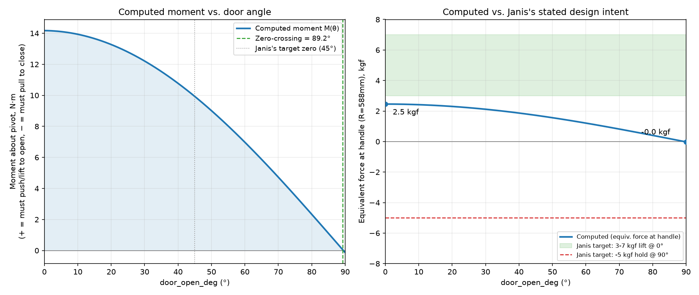

# Lid Hinge Moment Analysis — 0° to 90°, current geometry (2026-07-30)

Real gravity moment about the shared pivot (`FC_Y`/`FC_Z` =
`HINGE_PIVOT_Y`/`HINGE_PIVOT_Z`, `BBQ-chambers-v26.scad`), computed from
the **current, live** geometry in `BBQ-offset-smoker-base-v13.scad` /
`BBQ-chambers-v26.scad` — not re-derived from an old assumption. This
supersedes `docs/lid-hinge-counterbalance-calc.md` (built on a retired
pivot and a retired CB1 counterweight-pipe design).

> **Revision note (same day):** the first version of this doc omitted
> the CB1 counterweight pipe — Janis clarified CB1 is actually TWO real
> parts: the bracket (Ua/Ub/Uc, locked, unchanged) that wraps/welds
> around a separate **4" square tube, both ends capped**, which is the
> real counterbalance mass. That pipe had been fully removed from the
> assembly since v11 and was never re-added as a mass — only the
> bracket/stopper was rebuilt. It has now been restored
> (`cb1_pipe()`, same 4"/`CB1_OD` size the bracket was always built to
> wrap, same `CB1_WALL`=3mm/span formula as the original v6-v9 design)
> and this analysis redone with it included.

## Method

1. Mass + CG of the rib+CB1 bracket, the visual lid shell, and the CB1
   counterweight pipe were taken from actual STL exports of the live
   OpenSCAD geometry (`rib_solid(RIB1_X, true)`, `lid(0)`, `cb1_pipe()`),
   volume/centroid computed by tetrahedron decomposition from the mesh
   triangles (`stl_mass.py`) — not hand-derived polygon/box math, since
   several of these shapes are `difference()`/`union()` results that are
   error-prone to reproduce by hand.
2. The handle rod's mass/CG is analytic (hollow tube + 2 end caps),
   since it's a simple rotationally-symmetric shape centered exactly on
   `[HANDLE_Y, HANDLE_Z]`.
3. Steel density 7850 kg/m³ (mild steel, this project's own standard
   sheet-metal material per `rules-bbq-fab.md`).
4. For a rigid body rotating about a fixed pivot via
   `rotate([-door_open_deg,0,0])`, a point's native/closed-frame offset
   from the pivot `(dy,dz)` maps to world position
   `Y(θ) = FC_Y + dy·cosθ + dz·sinθ`. Summing `m·g·Y(θ)` over every
   rotating component and differentiating gives a clean closed form:

   ```
   M(θ) = -g · (A·cosθ + B·sinθ)
   A = Σ mᵢ·dyᵢ   (kg·m, mass-weighted Y offset from pivot, closed frame)
   B = Σ mᵢ·dzᵢ   (kg·m, mass-weighted Z offset from pivot, closed frame)
   ```

   Sign convention matches Janis's own: **positive = user must lift/push
   to open (gravity favors closed)**, **negative = user must pull to
   close (gravity favors open)**.
5. Only parts that actually rotate with the door are included: the
   visual lid shell, all 3 rib+CB1 bracket assemblies, the handle rod,
   and the CB1 counterweight pipe. The hinge brackets (`hinge_bracket()`)
   are fixed to the chamber and excluded.

## Live inputs (echo'd / STL-measured from the actual files, 2026-07-30)

| Component | mass (kg) | dy from pivot (mm) | dz from pivot (mm) |
|---|---:|---:|---:|
| Lid shell (3 panels, `lid(0)`) | 8.803 | -172.53 | -218.69 |
| 3× rib+CB1 bracket (`rib_solid(RIB1_X,true)`, ×3) | 3.481 | -109.82 | -69.10 |
| Handle rod (hollow tube + end caps) | 0.644 | -352.66 | -470.34 |
| **CB1 counterweight pipe** (`cb1_pipe()`, 4" sq. tube, both ends capped) | **8.000** | **+85.40** | **+310.19** |
| **Total rotating mass** | **20.928** | | |

The CB1 pipe's real computed mass (8.000 kg from actual solid geometry)
lands almost exactly on Janis's own recollection ("~8 kg") and the
original locked `CB1_MASS_KG=8.06` value from
`archive/BBQ-offset-smoker-base-v9.scad` — same OD/wall/span convention,
independently re-derived here from the current geometry, not copied.
Note it's the only component with a **positive** dy/dz: it sits on the
far side of the pivot from the door's own bulk, which is exactly what a
counterweight is for.

`FC_Y=242.665mm`, `FC_Z=1345.34mm`, `R_HANDLE=587.867mm`.

`A = -1.445 kg·m`, `B = +0.013 kg·m` (was `A=-2.128`, `B=-2.468` before
the pipe was added — the pipe pulls both terms sharply toward zero/
positive, as expected for a counterweight).

## Result (with the CB1 pipe restored)

| Angle | Moment | Equivalent force at handle |
|---|---:|---:|
| 0° (closed) | +14.2 N·m | **+2.5 kgf** (must lift to start opening) |
| 45° | +10.0 N·m | +1.7 kgf |
| 90° (full open) | -0.13 N·m | **-0.02 kgf** (just barely past level) |

Zero-crossing: **89.2°** — the moment stays positive (closing-favored)
almost the entire way, only dipping negative in the last degree of
travel.



## Comparison against Janis's stated design intent

| Janis's requirement | Target | Computed (with CB1 pipe) | Verdict |
|---|---|---|---|
| Startup lift at 0° | 3-7 kgf to begin lifting | 2.5 kgf | **CLOSE, slightly under** |
| Zero moment at/after 45° | crosses to negative at 45° or later | crosses at 89.2° | **TECHNICALLY MEETS "or later," but far later than 45°** |
| Gentle negative before 90° (no slam shut) | negative before reaching 90° | negative only in the last ~1° | **MARGINAL** |
| Self-holding at 90° (won't fall back closed) | ~5 kgf pull needed to bring it down | -0.02 kgf — essentially neutral equilibrium | **FAILS** |

**Big improvement over the no-counterweight case** (previously the
moment never went negative at all), but restoring the pipe at its
*current* position/size (tuned for bracket clearance, not for this
moment target) lands the design almost exactly *balanced* rather than
*self-holding open*: at 90° the door is in near-neutral equilibrium
(essentially weightless to hold, but also not gripping itself open with
any real margin — a light bump could tip it either way). To hit
Janis's actual target (a real ~5 kgf pull needed to close it from 90°,
and the zero-crossing nearer 45-60° instead of 89°) would need *more*
counterweight leverage on the far side of the pivot — e.g. a heavier
pipe, a longer `CB1_STANDOFF`, or moving `CB1_EDGE_FRAC` — a real
tuning decision on the 3 adjustable knobs, not a code defect. CB1's
position wasn't moved in this round since Janis called the bracket
"locked" — flagging this for a decision rather than changing it
unilaterally.
