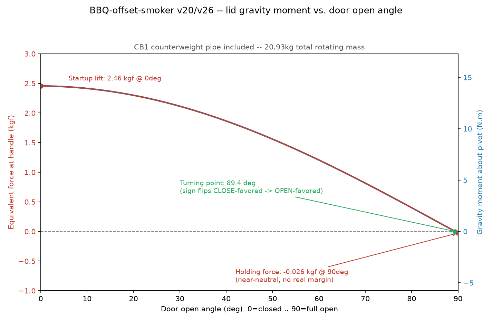

# Lid Hinge Moment Analysis — Full 0°-90° Sweep (2026-07-31, v20/v26)

Real gravity moment about the shared pivot (`FC_Y`/`FC_Z` =
`HINGE_PIVOT_Y`/`HINGE_PIVOT_Z`, `BBQ-chambers-v26.scad`), computed from
the **current, live** geometry in `BBQ-offset-smoker-base-v20.scad` /
`BBQ-chambers-v26.scad`. Supersedes the previous 3-point (0°/45°/90°)
version of this doc — same method, extended to every integer degree,
re-derived fresh (not copied) to confirm the v19→v20 tray-link rewrite
did not touch the lid/rib/CB1 mass or pivot (it didn't — the tray
folding mechanism is a separate system, see
`docs/tray-relocation-bracket.md`).

## Method

1. Mass + CG of the rotating rigid body (visual lid shell, 3×
   rib+CB1 bracket, handle rod, CB1 counterweight pipe) taken from
   actual STL exports of the live OpenSCAD geometry
   (`lid(0)`, `rib_solid(RIB1_X,true)`, `cb1_pipe()`), volume/centroid
   computed by tetrahedron decomposition from the mesh triangles
   (`stl_mass.py`), not hand-derived polygon/box math. Every other
   assembly (chamber shell, firebox, exhaust room, trays, wheels/axles/
   fenders) suppressed via each file's own DEBUG TOGGLES so each STL
   contains exactly one part — verified empty-geometry first
   (`show_*=false` on everything → `Current top level object is empty`)
   before trusting the isolated exports.
2. Handle rod mass/CG is analytic (hollow tube + 2 end caps, OD 25.4mm/
   wall 2mm/span 548mm — `handle_x1-handle_x0`, echo()-verified), since
   it's a simple rotationally-symmetric shape centered exactly on
   `[HANDLE_Y, HANDLE_Z]`.
3. Steel density 7850 kg/m³ (mild steel, this project's own standard
   sheet-metal material per `rules-bbq-fab.md`).
4. For a rigid body rotating about a fixed pivot via
   `rotate([-door_open_deg,0,0])`, a point's native/closed-frame offset
   from the pivot `(dy,dz)` maps to world position
   `Y(θ) = FC_Y + dy·cosθ + dz·sinθ`. Summing `m·g·Y(θ)` over every
   rotating component and differentiating gives a clean closed form:

   ```
   M(θ) = -g · (A·cosθ + B·sinθ)
   A = Σ mᵢ·dyᵢ   (kg·m, mass-weighted Y offset from pivot, closed frame)
   B = Σ mᵢ·dzᵢ   (kg·m, mass-weighted Z offset from pivot, closed frame)
   ```

   Sign convention (Janis's own): **positive = user must lift/push to
   open (gravity favors closed)**, **negative = user must pull to close
   (gravity favors open)**.
5. Equivalent force at the handle: `F_kgf(θ) = M(θ) / (g · R_HANDLE)`,
   `R_HANDLE = norm([HANDLE_Y-FC_Y, HANDLE_Z-FC_Z])` — the handle's own
   fixed radius from the pivot (echo()-verified live: 587.867mm).
6. Zero-crossing solved in closed form from the same A/B:
   `tan(θ) = -A/B`, root selected in `[0°,90°]`.
7. Only parts that actually rotate with the door are included. The
   hinge brackets (`hinge_bracket()`) and axle are fixed to the chamber
   and excluded.

## Live inputs (echo()/STL-verified fresh, 2026-07-31, against v20/v26)

| Component | mass (kg) | dy from pivot (mm) | dz from pivot (mm) |
|---|---:|---:|---:|
| Lid shell (3 panels, `lid(0)`) | 8.8029 | -172.529 | -218.693 |
| 3× rib+CB1 bracket (`rib_solid(RIB1_X,true)`) | 3.4806 | -109.816 | -69.100 |
| Handle rod (hollow tube + end caps, analytic) | 0.6438 | -352.665 | -470.340 |
| CB1 counterweight pipe (`cb1_pipe()`, 4" sq. tube, both ends capped) | 8.0067 | +85.405 | +310.193 |
| **Total rotating mass** | **20.934** | | |

`FC_Y=242.665mm`, `FC_Z=1345.34mm` (this round found and fixed a stale
`1445.335mm` comment next to `HINGE_PIVOT_Z` in `BBQ-chambers-v26.scad`
— the comment never matched the live computed value; the code itself
was always correct). `R_HANDLE=587.867mm`.

`A = -1.4442 kg·m`, `B = +0.0152 kg·m` — matches the prior 3-point doc's
`A=-1.445`/`B=+0.013` to within rounding, confirming this round's fresh
re-derivation reproduces the same physics (as expected — nothing in the
v19→v20 tray-link rewrite touches this rigid body).

## Full sweep, 0°-90° (1° steps)



**Turning point (positive → negative crossing): 89.4°.** The moment
stays positive (closing-favored — user must actively lift/hold) across
essentially the entire swing, only turning negative in the last ~0.6°
before full stow.

**Startup door-open force (0°, closed): 2.46 kgf** — the force needed
at the handle to begin lifting the lid from fully closed.

**Holding force at full open (90°) to prevent accidental drop: 0.03 kgf**
(moment = -0.15 N·m). This is **not** a real self-holding margin — it's
near-neutral equilibrium. A light bump in either direction can tip it;
there is no meaningful resistance to the door swinging back closed on
its own, contrary to Janis's stated ~5 kgf holding target (see
Comparison table below).

| deg | M (N·m) | kgf | | deg | M (N·m) | kgf | | deg | M (N·m) | kgf |
|---:|---:|---:|---|---:|---:|---:|---|---:|---:|---:|
| 0 | 14.168 | 2.457 | | 31 | 12.067 | 2.093 | | 61 | 6.738 | 1.168 |
| 1 | 14.163 | 2.456 | | 32 | 11.936 | 2.070 | | 62 | 6.520 | 1.131 |
| 2 | 14.154 | 2.454 | | 33 | 11.801 | 2.046 | | 63 | 6.299 | 1.092 |
| 3 | 14.140 | 2.452 | | 34 | 11.662 | 2.022 | | 64 | 6.077 | 1.054 |
| 4 | 14.123 | 2.449 | | 35 | 11.520 | 1.998 | | 65 | 5.853 | 1.015 |
| 5 | 14.101 | 2.445 | | 36 | 11.374 | 1.972 | | 66 | 5.627 | 0.976 |
| 6 | 14.075 | 2.441 | | 37 | 11.225 | 1.946 | | 67 | 5.399 | 0.936 |
| 7 | 14.044 | 2.435 | | 38 | 11.073 | 1.920 | | 68 | 5.169 | 0.896 |
| 8 | 14.009 | 2.429 | | 39 | 10.917 | 1.893 | | 69 | 4.938 | 0.856 |
| 9 | 13.970 | 2.422 | | 40 | 10.757 | 1.865 | | 70 | 4.706 | 0.816 |
| 10 | 13.927 | 2.415 | | 41 | 10.595 | 1.837 | | 71 | 4.472 | 0.775 |
| 11 | 13.879 | 2.407 | | 42 | 10.429 | 1.808 | | 72 | 4.236 | 0.735 |
| 12 | 13.827 | 2.398 | | 43 | 10.260 | 1.779 | | 73 | 4.000 | 0.694 |
| 13 | 13.771 | 2.388 | | 44 | 10.088 | 1.749 | | 74 | 3.762 | 0.652 |
| 14 | 13.711 | 2.377 | | 45 | 9.913 | 1.719 | | 75 | 3.523 | 0.611 |
| 15 | 13.646 | 2.366 | | 46 | 9.735 | 1.688 | | 76 | 3.283 | 0.569 |
| 16 | 13.578 | 2.354 | | 47 | 9.553 | 1.657 | | 77 | 3.042 | 0.527 |
| 17 | 13.505 | 2.342 | | 48 | 9.369 | 1.625 | | 78 | 2.800 | 0.486 |
| 18 | 13.428 | 2.328 | | 49 | 9.183 | 1.592 | | 79 | 2.557 | 0.443 |
| 19 | 13.347 | 2.314 | | 50 | 8.993 | 1.559 | | 80 | 2.314 | 0.401 |
| 20 | 13.262 | 2.300 | | 51 | 8.800 | 1.526 | | 81 | 2.069 | 0.359 |
| 21 | 13.173 | 2.284 | | 52 | 8.605 | 1.492 | | 82 | 1.824 | 0.316 |
| 22 | 13.080 | 2.268 | | 53 | 8.407 | 1.458 | | 83 | 1.579 | 0.274 |
| 23 | 12.983 | 2.251 | | 54 | 8.207 | 1.423 | | 84 | 1.333 | 0.231 |
| 24 | 12.882 | 2.234 | | 55 | 8.004 | 1.388 | | 85 | 1.087 | 0.188 |
| 25 | 12.777 | 2.216 | | 56 | 7.799 | 1.352 | | 86 | 0.840 | 0.146 |
| 26 | 12.669 | 2.197 | | 57 | 7.591 | 1.316 | | 87 | 0.593 | 0.103 |
| 27 | 12.556 | 2.177 | | 58 | 7.381 | 1.280 | | 88 | 0.346 | 0.060 |
| 28 | 12.439 | 2.157 | | 59 | 7.169 | 1.243 | | 89 | 0.098 | 0.017 |
| 29 | 12.319 | 2.136 | | 60 | 6.955 | 1.206 | | 90 | -0.149 | -0.026 |
| 30 | 12.195 | 2.115 | | | | | | | | |

Full 91-row per-degree data lives alongside this doc's own generation
script (not committed — regenerate via the same STL exports + closed-
form A/B above if a future round needs the raw numbers).

## Comparison against Janis's stated design intent

| Janis's requirement | Target | Computed (full sweep, CB1 pipe included) | Verdict |
|---|---|---|---|
| Startup lift at 0° | 3-7 kgf to begin lifting | 2.46 kgf | **CLOSE, slightly under** |
| Zero moment at/after 45° | crosses to negative at 45° or later | crosses at 89.4° | **TECHNICALLY MEETS "or later," but far later than 45°** |
| Gentle negative before 90° (no slam shut) | negative before reaching 90° | negative only in the last ~0.6° | **MARGINAL** |
| Self-holding at 90° (won't fall back closed) | ~5 kgf pull needed to bring it down | 0.03 kgf — essentially neutral equilibrium | **FAILS** |

**Unchanged conclusion from the prior round:** CB1's current
position/size (tuned for bracket clearance, not for this moment target)
lands the design almost exactly *balanced* rather than *self-holding
open* — a real tuning decision on CB1's 3 adjustable knobs
(`CB1_STANDOFF`, `CB1_EDGE_FRAC`, or a heavier pipe), not a code defect.
Not changed unilaterally this round since Janis called the CB1 bracket
"locked" — flagged for a decision.
