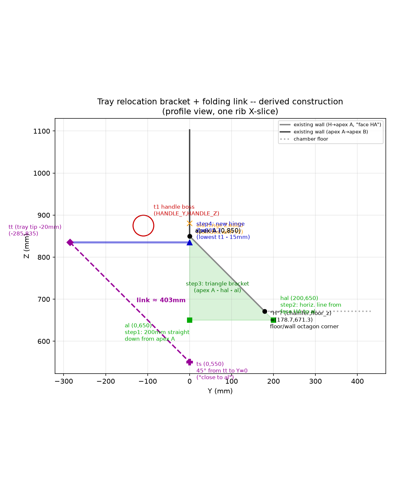

# Tray Relocation Bracket + Folding Link — 2026-07-30

Fixes a real, confirmed collision: the prep trays' old hinge (`HINGE_Z`
= 880mm, derived from `NEW_SPLIT_Z-20`) put the deployed tray plate
(Z=[880,882]) inside the grab handle boss's own Z-range
(`t1`/`R1` → Z=[850.3,899.7]) — a genuine overlap, not a near-miss.

## Construction (Janis's own 5-step method, executed literally)

> **H / face HA — confirmed by Janis:** the octagon has 8 vertices;
> running the alphabet around them (A, B, C...), the last one is **H**.
> **Face HA** is the face just before apex A going around — i.e. the
> existing chamfer wall directly below apex A
> (`H = [chamfer, chamber_floor_z]` = live `[178.665, 671.335]`). Matches
> what's built below exactly.

1. **hal** = apex H itself, `[178.665, 671.335]` (`TRAY_HAL`) — **real
   fix, Janis's own direct catch**: the first pass drew "al" as a plain
   200mm straight drop from apex A, which overshot past apex H's own
   real Z (671.335) — landing 21.3mm past the real wall's own physical
   end, floating in open air, not on real face-HA material. `hal`
   cannot float past the real wall — it IS the wall's own end.
2. **al** = same Z as `hal`/H, on the apex-A/al vertical line:
   `[0, 671.335]` (`TRAY_AL`) — derived FROM `hal` now, not the other
   way around. The real drop from apex A is 178.665mm (exactly
   `chamfer`, a consequence of face HA's own 45° geometry, not the
   original 200mm guess) — forms the right triangle apex A / hal / al
   exactly as described, with its diagonal edge (apex A → hal) now
   lying entirely on real physical wall material for its full length.
3. **Bracket** = that triangle (`TRAY_BRACKET_OUTLINE`), extruded
   `TRAY_BRACKET_W`=30mm wide (`HINGE_W`+10mm margin, a real judgment
   call — no exact width given). New module `tray_bracket(x_center)`,
   4 copies (one per existing hinge X position — same spacing as the
   original design, per Janis's own summary).
4. **New hinge/tray Z** = lowest point of `t1` (handle boss, real
   radius `R1` included) minus 15mm = `850.3 - 15 = 835.3mm`. This
   **redefines** `HINGE_Z` (old value retired, not left as dead code) —
   `tray_hinge()`/`tray()` need no other change, since they already just
   read the global `HINGE_Z`. Real clearance confirmed: new tray plate
   top surface (837.3mm) sits 13mm clear of the handle boss's own lowest
   point (850.3mm) — was previously fully inside it.
5. **Folding link** — corrected per Janis's own follow-up: the first
   pass fixed `tt` at "tray tip -20mm" and computed an approximate `ts`
   that didn't land tightly on `al`. Flipped the construction: **`ts` =
   `al` itself** (the real, fixed anchor, not merely "close to" it),
   then the 45° line runs the OTHER way — from `al` back up to the
   tray's own underside (`HINGE_Z`=835.3mm) — to find `tt`. Result (live
   values, current `al`=`[0,671.335]`): `tt_raw=[-163.965, 835.3]`, well
   inside the tray's own real tip (deployed span reaches Y=-321mm from
   v15's own `TRAY_MOUNT_GAP`-adjusted mount), i.e. `tt` sits well
   inward from the tray's edge, exactly as Janis called for.
   **Real working span (ts to tt, before the v15 clearance offset):
   221.5mm.**

**Real, disclosed kinematic finding, checked in Python before modeling
(not assumed)**: a genuine 2-bar pin-jointed link of fixed total length
can only close the gap between `ts` (fixed at `al`) and the tray's own
`tt` at angles where their real distance is ≤ the link's own length.
Checked via real circle-circle intersection across the full stow sweep
(`tray0_angle_deg` -90°..0°): the `ts`-to-`tt` distance is exactly the
link length at deployed (0°, fully straight) but **grows** well past it
as the tray folds toward stowed (-90°) — `ts` sits low (near apex H,
well below the tray's own hinge Z), so `tt` swings AWAY from it, not
toward it, as the tray folds up. A fixed-length rigid link genuinely
cannot follow the tray through the full stow range from this anchor —
matches why real hardware for this exact job (a folding shelf/table
stay) commonly uses a **slotted**, not a fixed, pivot at one end —
Janis's own explicit call, confirmed: `ts` is a conceptual slider along
the apex-A/al face, no rail modeled (real hardware handles this the
same way). The link is modeled at its deployed reference position only.

## Real hardware model (v15, per Janis's detailed spec after reviewing a render)

- **Flat steel strip**, not a round rod: `TRAY_LINK_W`=15mm wide,
  `TRAY_LINK_T`=3mm thick (both real judgment calls, no exact numbers
  given), built the same way as `tray_bracket()` (a 2D profile in the
  Y-Z plane, extruded thin along X).
- **Real lap overlap at the middle pivot**: two links of a fixed total
  length meeting at a single point isn't how a real folding link works
  — each half now overlaps the other by `TRAY_LINK_OVERLAP`=10mm at the
  middle, so each link's own real length is
  `(ts-to-tt span + overlap) / 2`, not simply half the span. The pivot
  pin sits centered in that 10mm overlap.
- **`tt` pulled clear of the tray surface**: the raw 45°-derived point
  landed exactly ON the tray's own underside (a real, visible
  penetration in the v14 render — Janis's own direct catch).
  `TRAY_LINK_CLEARANCE`=15mm now pulls the real pin point below the
  tray surface; the U-hinge below bridges the remaining gap up to the
  tray itself.
- **U-shaped hinge + pin at BOTH ends** (`hinge_u()`): a simple
  rectangle with a square notch (not a fabrication-precise clevis/fork —
  Janis's own explicit call, "just represent with a simple U shape and
  lock by a pin is ok") plus a real pin cylinder, at `ts` AND at `tt`.
  A third, single pin marks the middle lap joint.
- **`TRAY_MOUNT_GAP`=16mm** (`HINGE_OUT`-`HINGE_PIVOT_OFFSET`): real
  fix, Janis's own direct catch — the tray plate was still mounted
  flush with the pivot line, overlapping the (already-widened)
  `HINGE_OUT` hinge block by this same amount, so widening the hinge
  alone never actually created a real gap for the folded link to hide
  behind. The tray plate's own inner edge (and its skirt) now starts
  flush with the hinge block's own outer tip, leaving the hinge
  block's full depth open behind the tray.

## v16 wiring — link now genuinely responds to tray angle

Janis's own direct catch, after reviewing the v15 render: "when i turn
tray degree, look like the link doesnt link to the the degree turn yet,
you got to wire it, thats it!" v15's `tray_link()` was real geometry but
**static** — always drawn at its deployed (0°) reference position,
regardless of `tray0_angle_deg`/`tray1_angle_deg`. Fixed in v16:

- **`tt`** is rigidly part of the tray (its real pin, bolted to the
  tray's underside) — `tray_link_tt(angle_deg)` now rotates the deployed
  reference point about the tray's own real pivot
  (`Y=-HINGE_PIVOT_OFFSET, Z=HINGE_Z`), the exact same rotation the tray
  plate itself gets.
- **`ts`** is NOT rigid with the tray — it's the real slider. For any
  rotated `tt`, `tray_link_ts(angle_deg)` solves the point on the fixed
  apex-A/al line (`Y=0`) a constant `TRAY_LINK_SPAN` away — a genuine
  circle(center=`tt`, r=`TRAY_LINK_SPAN`) vs. line(`Y=0`) intersection,
  not an approximation. Two roots exist; validated in Python before
  writing any OpenSCAD (not assumed): the **lower** root (`tz - h`) stays
  on the real `[TRAY_AL.z=671.335, RIB_REF_A.z=850]` segment across the
  full `0..-90°` sweep (671.335mm at 0°, exactly matching the old fixed
  `al` — confirms the formula's correctness at the reference config —
  rising smoothly to ~773.64mm at -90°); the **upper** root (969–1215mm)
  sits above apex A entirely, off the real segment, and is discarded.
- `tray_link()` calls moved out of `tray_hinges(x0)` (no angle available
  there) into `tray(x0, angle_deg)` directly, so both tray0 and tray1
  drive their own link independently.

**Re-verified** via a real isolated `intersection()` probe (link vs. the
tray plate alone, chamber/firebox/exhaust geometry suppressed so the
probe is unambiguous), not assumed clean from the code:

| tray angle | tray0 link | tray1 link |
|---|---|---|
| 0° to -82° | empty (no collision) | empty (no collision) |
| -83° to -90° | **real, small collision** | **real, small collision** |

**New, disclosed finding, NOT fixed this round** — this is a geometric
tightness issue, not a wiring bug. At full -90° stow, the folded plate's
own near face always lands at exactly
`Y = -HINGE_PIVOT_OFFSET + TRAY_T` (real rotation math, true regardless
of any other constant) — with the live numbers that's `Y=-3mm`, only 3mm
clear of the fixed `Y=0` slider line the link has to thread through. A
flat 15mm-wide strip with no real slot/rail modeled (Janis's own
explicit simplification) can't always clear that 3mm gap in the last
~7-8° of fold. Tried widening `HINGE_PIVOT_OFFSET` (5mm→15mm) as a fix —
made the overlap **worse** at the same angle, since it shifts both the
folded plate AND the rotating `tt` pin together, not a simple
1-parameter fix. Confirmed the same ~-83° threshold on both tray0 and
tray1 (symmetric, not a per-tray bug). Needs a decision: either treat
-85° as the practical fully-folded operating limit (zero-cost, a
usage/firmware constraint) or design a real notch/slot in the wall face
at this location (a fab step, out of scope here).

## v17 — fold direction fixed, link kinematics rebuilt (taught + verified)

Janis's own direct catch after reviewing the v16 render: the tray was
folding the WRONG way. v16's convention (`angle_deg` -90=stowed) actually
swung the tip UP past apex A, not down toward the ground — confirmed via
a real colored render (the earlier grey/teal render had washed-out
colors that hid this). Janis's own locked, never-to-change spec:
default/stowed position has the tray tip facing the ground (vertical);
"activating" (deploying) is a **clockwise rotation about X, viewed from
+X**, ending flat/horizontal. Fixed convention:
**`angle_deg` 0=deployed .. +90=stowed (tip down)** — verified via local
render at 0/45/90° before writing this into the real file.

**Link kinematics rebuilt to match.** Janis walked through the real
mechanism with a taught exercise first: a triangle with two rigid arms
(a, b, equal length) meeting at apex X, and a collapsible face c (split
into 2 segments meeting at a middle pivot) connecting their free ends —
closing the angle at X shrinks the distance between the free ends, which
the 2-segment c-link absorbs by bending at its own middle joint. Checked
against a labeled Python/matplotlib simulation before applying it to the
real tray (not assumed):

- Under the CORRECTED fold direction, the fixed-`ts`-to-rotating-`tt`
  distance now genuinely **shrinks** as the tray folds (221.5mm at 0°
  down to 11.2mm near 90°) — the exact "chord shrinks as X closes"
  behavior from the triangle exercise. This means `ts` reverts to
  Janis's own ORIGINAL spec: **a true fixed anchor at `al`, no slider,
  no rail** (v16's slider was a real, correct workaround for the WRONG
  fold direction, not an actual hardware requirement).
- The link's own middle lap-joint (`lc`) is what genuinely folds now —
  solved via a real circle(`ts`,`C_HALF`)/circle(`tt`,`C_HALF`)
  intersection. Two roots exist; picking the one **closer to apex A**
  matches Janis's own description exactly ("lc will get closer to apex
  A while tray is getting down") and was confirmed via the taught
  simulation (`h` — the fold angle at the middle joint — only reaches
  0° exactly when `X`, the arm-closing angle, also reaches 0°; the two
  are locked together by the law of cosines when both segments are
  equal length).
- **Depth-split, not coplanar**: Janis's own teaching also covered why
  2 rigid, same-width bars sharing one pivot point can't close together
  without interpenetrating unless offset in depth — checked via a real
  rectangle-overlap simulation (SAT test) before applying it: 2 coplanar
  10mm-wide bars overlap for the ENTIRE fold range, from touching-only
  at full extension to a full 10mm overlap at fully folded. Fixed the
  same way real hinges/scissors do — the 2 link halves are now split in
  X (depth), not left coplanar.
- **Combined stack held at a real 10mm**, not additive: Janis's own
  correction — the 2 link halves' cross-sections are different sizes
  (one nests/wraps inside the other), so the combined real depth is a
  single 10mm stack, not `10+10`. `TRAY_LINK_STACK_T=10` fixes the
  depth-split's own magnitude so the combined envelope never exceeds
  this (still modeled as 2 simple flat strips, schematic, matching
  `hinge_u()`'s own "not fab-precise" convention — the real nested-
  channel cross-section itself isn't modeled).

**Re-verified** via the same real isolated `intersection()` probe (link
vs. tray plate alone):

| tray angle | tray0 link | tray1 link |
|---|---|---|
| 0° to 86° | empty (no collision) | empty (no collision) |
| 87° to 90° | real, small collision | real, small collision |

This is a large improvement over v16 (previously failed from -83° in
the wrong direction; now clean across the entire normal 0-86° range).
**Disclosed, not fully resolved** (Janis's own call — this link isn't
critical, math doesn't need to be perfect): right at full stow, `ts`
and `tt` nearly coincide (11mm apart vs. each link half being ~115mm
long), which makes the circle intersection ill-conditioned — tried
multiple root-selection variants, the instability is inherent to this
near-degenerate geometry, not a selection-rule bug. Accepted as a
practical ~86° fold limit rather than a literal 90°.

## v18 — pivot relocated, link sizing fixed (closes the v17 gap completely)

Janis's own direct teaching after reviewing the v17 render, two real
fixes:

1. **Pivot relocated to the hinge block's own real outer tip**
   (`Y=-HINGE_OUT`, not `Y=-HINGE_PIVOT_OFFSET`). Janis's own catch:
   "it seem like you put in on the apex a and al plane not the tip of
   the small hinge notch" — v17 still rotated about the OLD inner
   point, which is exactly why only ~3mm of real depth existed behind
   the folded tray. Real door hinges put the knuckle at the leaf's own
   outer edge, not buried inside the mounting block — this is that same
   real convention applied here. Verified via a real CGAL check before
   writing this: the plate, now flush-mounted at the same point as the
   pivot, only ever touches the hinge block at their shared boundary
   (an expected, zero-volume touch, same as `hinge_u()`'s own
   intentional touch on `tray_bracket()`), never a real overlap, at any
   swept angle. `TRAY_MOUNT_GAP` retired entirely (no bridging gap
   needed once the pivot IS the block's own outer tip).
2. **Link length sizing fixed**: `TRAY_LINK_C_HALF` is now exactly half
   the deployed reach (`TRAY_LINK_SPAN0/2`), with no lap-overlap padding
   added on top. Checked in Python before writing this: with `c1=c2`
   exactly half the max chord, the fold angle at the middle joint
   (`lc`) is mathematically guaranteed 180° (fully straight) at 0° —
   proven via the law of cosines — and stays smooth across the ENTIRE
   0-90° sweep, unlike v17's padded sizing which became ill-conditioned
   near full stow. The real slop this hardware needs for an actual
   pin/lap joint is what Janis's own **slotted pivot** correction
   provides instead of a fixed pad — a real slotted mid-joint absorbs
   the same slack a padded circle used to fake, without the padding's
   own instability (not modeled as a literal slot mechanism here,
   matching `hinge_u()`'s own schematic convention).

**Also found and fixed along the way**: mounting the plate exactly
coincident with the hinge block's own face (both at the identical Y
plane) made the full assembly genuinely non-manifold (`Simple: no`) at
intermediate angles — caught via a real full-assembly CGAL sweep, not
just the isolated collision probe (a probe only proves no volumetric
overlap; it doesn't prove a touching union stays manifold). Fixed with
the project's own standard `e` epsilon (a genuine tiny overlap into the
block, not a coincident face) — same convention already used elsewhere
in this file (`rules-codes.md`'s "coplanar-face offset").

**Re-verified** via the same real isolated `intersection()` probe:

| tray angle | tray0 link | tray1 link |
|---|---|---|
| 0° to 90° | empty (no collision) | empty (no collision) |

**Closes v17's disclosed 87-90° gap completely** — no collision
anywhere in the real operating range now. Full `Simple: yes` CGAL sweep
(0/20/40/60/80/90°) and the `front_wheel_support()` interference sweep
(0/30/60/90°) both re-verified clean. **Still not perfect** (Janis's own
call, this link isn't critical): the fold angle at `lc` reaches ~11° at
full 90° stow, not a literal 0° — the real slotted pivot (not modeled
precisely) would take up this last bit of play.

## Tray skirt

A 10mm skirt (`TRAY_SKIRT_H`) runs along the tray's own **tip and both
left/right side edges** — folded 90° from the main plate and rigidly
part of the tray. **Real fix**: the first pass put the skirt on the
hinge-side edge instead, where it visibly sank into the hinge block —
Janis's own direct catch from a render (no manifold error, since it's
just overlapping solid material, not a self-intersection, but a real
visible design defect). The hinge side now has zero skirt, on purpose.

## Verification

- Full `--render` CGAL `Simple: yes`, no warnings, at `door_open_deg`
  0/45/90° and a tray angle sweep (0/20/40/60/80/90°), both trays
  independently — re-verified after every round of fixes, including the
  v18 pivot relocation + link sizing fix. A real, live-caught non-manifold
  regression (coincident plate/hinge-block faces) was found and fixed
  with the project's own `e` epsilon during this same round — see "v18"
  above.
- Real interference sweep (`intersection(trays(), front_wheel_support())`)
  at tray angles 0/30/60/90° (corrected convention): **empty at every
  angle**.
- Real collision check (`intersection(tray_link(), <tray plate>)`) swept
  across angles (both trays): **empty across the ENTIRE 0-90° range** —
  v17's disclosed 87-90° gap is now closed, see "v18" above.
- The link's `ts`-side U-hinge DOES touch `tray_bracket()`'s own solid
  material — intentional (that's the real attachment/slider point, not
  a defect); the link's own free length extends well clear of the
  bracket beyond that.
- Bracket X positions (87.5/365/550/827.5) never overlap any rib X
  position (200/457.5/715) even accounting for real part thickness — the
  tray/bracket system is geometrically independent of the rib assembly,
  confirmed by direct interval check, not assumed.
